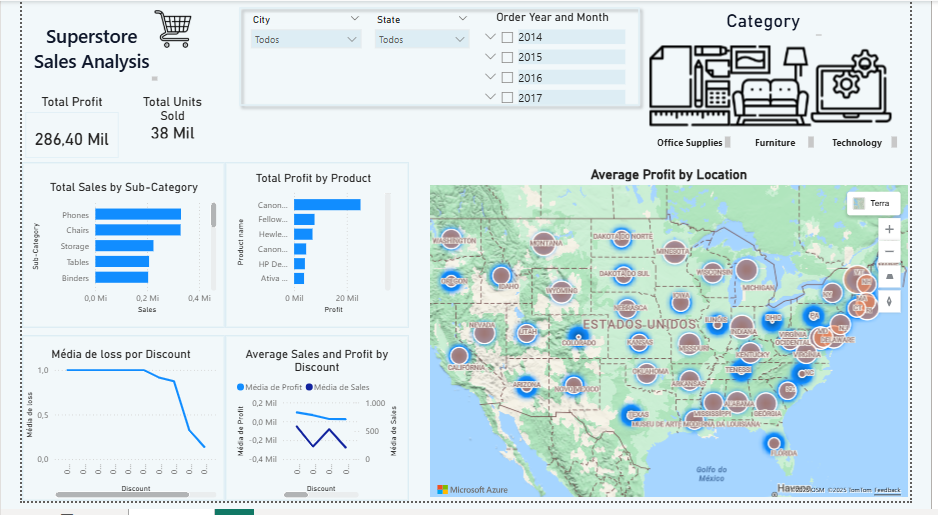

# Financial Stock Analysis Dashboard | Painel de Análise de Ações Financeiras

## 📊 Dashboard Preview | Visualização do Dashboard

## 📊 Data Overview | Visão Geral dos Dados
**English:** This dashboard analyzes comprehensive stock data including:
- **Fundamentals**: Market value, P/L, Dividend Yield (DY), Return on Equity (ROE), Intrisic value and P/VP or price to book value (market price/ book value)
- **Profit**: Net profit over the last 3 and 12 months
- **Revenue**: Net revenue over the last 3 and 12 months
- **Stock price**: Min and Max stock price over the last 52 weeks, current stock price
- **Dynamic Candlestick Chart**: Visual analysis of price movements, market sentiment and trend reversals
- **Dynamic Stock analysis**: Stock selection and analysis with a timeline chosen by the user

**Português:** Este dashboard analisa dados abrangentes ações financeiras:
- **Fundamentos**: Valor de mercado, P/L, Rendimento de dividendo, retorno sobre o patrimônio líquido (ROE), valor intrínseco e P/VP (Preço do ativo sobre o valor patrimonial)
- **Lucro**: Lucro liquído dos últimos 3 e 12 meses
- **Receita**: Receita liquída dos últimos 3 e 12 meses
- **Preço da ação**: Preço Minímo e máximo da ação nas últimas 52 semanas, preço atual
- **Gráfico dinâmico de candlestick**: Análise visual de movimentação do preço, sentimento do mercado e reversões de tendências
- **Análise de ação dinãmica**: Seleção e análise de ação em período escolhido pelo usuário

## ✨ Key Features | Principais Funcionalidades
- **Timeseries financial analysis** | **Análise financeira temporal**
- **Interactive charts and filters** | **Gráficos e filtros interativos**
- **Market behavior analysis** | **Análise de comportamento do mercado**
- **Intrinsec Analysis with stock/company health insights** | **Análise Intrínseca com entendimento de saúde da ação/empresa**

## 🔗 Live Dashboard | Dashboard Online
**Click the link below to open the interactive dashboard in a new tab:**
**Clique no link abaixo para abrir o dashboard interativo em uma nova aba:**

🔗 <a href="https://app.powerbi.com/view?r=eyJrIjoiNjJlYWNmMDMtMGIyYi00MjI1LWJjYmEtNDJkM2Q1ZDI5MWYxIiwidCI6IjAyZGU0MmU3LTBjODUtNDNlNC1hYjIyLWQ4ZTM2MzJmMWE0NyJ9" target="_blank">View Interactive Dashboard on Power BI Service</a>

*Tip: Right-click → "Open in new tab"* |
*Dica: Clique com botão direito → "Abrir em nova guia"*

## 📁 Files Included | Arquivos Incluídos
- `Dashboard.pbix` - Main Power BI file | Arquivo principal do Power BI
- `dashboard_analise_financeira.png` - Dashboard screenshot | Captura de tela do dashboard

## 🚀 Getting Started | Como Usar
1. Open the Power BI Dashboard in a new tab | Abra o Dashboard do Power BI em uma nova guia
2. Start interacting with it | Comece a interagir com ele
